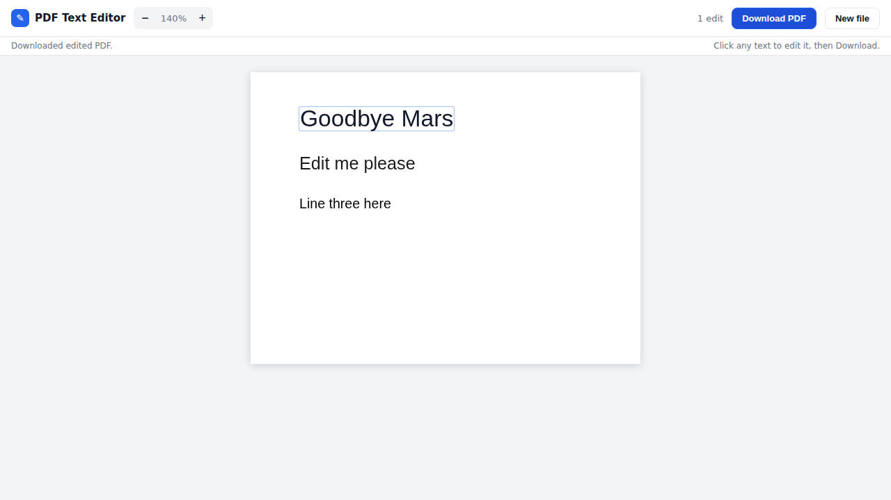

# PDF Text Editor

Upload a PDF, edit its text directly on the page, and download the result —
entirely in your browser. No server, no uploads, no accounts.



## How it works

1. **Upload** — drop a PDF onto the page (or click to browse). The file is
   read locally with the [File API]; nothing leaves your machine.
2. **Render** — [PDF.js] rasterises each page to a `<canvas>` and extracts the
   text fragments with their exact positions and fonts.
3. **Edit** — each text fragment gets a transparent `contentEditable` overlay
   aligned to its glyphs. Click any text and type. Edited fragments paint an
   opaque box over the original so the preview matches the exported file.
4. **Download** — [pdf-lib] reopens the *original* bytes, draws a filled
   rectangle over each edited fragment, and redraws your new text in place.
   Untouched content is preserved exactly.

## Getting started

```bash
npm install
npm run dev      # start the dev server
npm run build    # type-check + production build to dist/
npm run preview  # serve the production build
```

Then open the printed URL and drop in a PDF.

## Project layout

```
src/
  pdf/
    types.ts      shared TypeScript types
    loader.ts     parse + render pages with PDF.js
    exporter.ts   write edits back into the PDF with pdf-lib
  components/
    PageView.tsx          one page: canvas + editable overlay
    EditableFragment.tsx  a single in-place editable text run
  App.tsx         upload, toolbar, viewer, download orchestration
```

## Limitations

This is a pragmatic, client-side editor — worth knowing where the seams are:

- **Edits are drawn over, not deleted.** An edited fragment is covered with a
  white rectangle and the new text is drawn on top. The original glyphs still
  exist in the content stream, so they remain extractable (copy/paste, search,
  screen readers). Do **not** use this to redact sensitive information.
- **Fonts are approximated.** The original embedded font is matched to the
  closest standard font (Helvetica / Times / Courier, with bold & italic),
  so edited text may not be a pixel-perfect match. Only WinAnsi-encodable
  characters are supported in edited text.
- **White background assumed.** Redaction rectangles are white by default,
  which suits typical documents. Coloured or image backgrounds behind edited
  text will show a white patch.
- **Text-only.** Layout, images, and vector graphics are preserved but not
  editable. Rotated text is not repositioned in the overlay.
- **Scanned PDFs** have no extractable text layer and so cannot be edited here.

## Tech

React · TypeScript · Vite · [PDF.js] · [pdf-lib]

[File API]: https://developer.mozilla.org/en-US/docs/Web/API/File
[PDF.js]: https://mozilla.github.io/pdf.js/
[pdf-lib]: https://pdf-lib.js.org/
